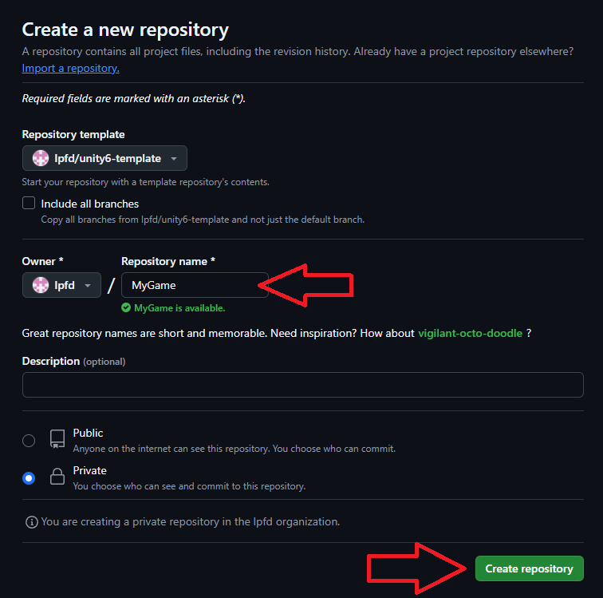
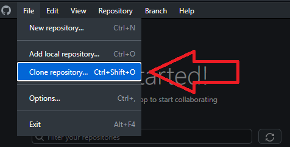

# Leap Forward Unity 6 Project Template

## Creating a Repository Using a GitHub Template

Sign in to GitHub: First, log in to your GitHub account.

Navigate to the Repository Template. Click "Use this template": On the template repository's main page, you will see a green button labeled "Use this template." Click on it.

Create a New Repository from the Template:

- **Owner**: Choose the owner of the repository (you or an organization you belong to).

- **Repository Name**: Enter a name for your new repository.

- **Description (optional)**: Add a description if you like.

- **Repository Settings**: Choose whether the repository should be public or private.

- **Create Repository**: Click the green button labeled "Create repository from template." Your new repository will be created based on the template.

## Cloning the Repository Locally Using GitHub Desktop

Launch the GitHub Desktop client on your computer. If you're not already signed in, click "Sign in to GitHub.com" and enter your credentials.

Click on the "File" menu in the top left corner. Select "Clone repository..." from the dropdown.

Choose the Repository to Clone:

URL or GitHub.com: If your repository is hosted on GitHub.com, select "GitHub.com.". Choose the repository you created from the list. If you don't see it, use the search bar to find it.

Click "Choose..." to select where on your computer you want to clone the repository.

Click the blue "Clone" button. GitHub Desktop will clone the repository to the selected location on your computer.

